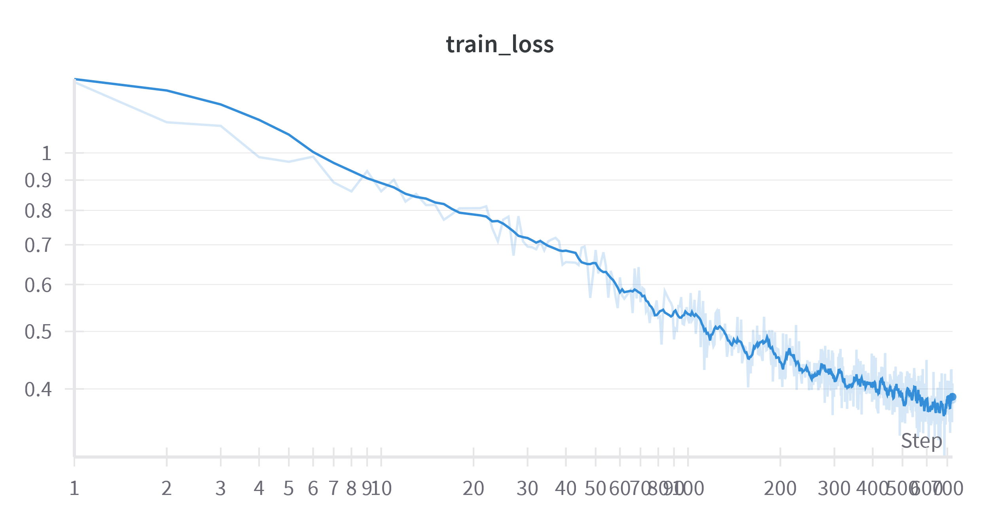

# Autoregressive frequency-domain image generation

Uses a decoder-only transformer to autoregressively generate images in the frequency domain.

## How it works

Here are some bulletpoints on how it works:

- A few invertible transformations are done on the image to put them into frequency domain in a nice format for autoregressive prediction. These need to be undone again for plotting.
  - fourier-transform without redundancy using rfft2
  - log1p is applied to bring the values into a reasonable range
  - flatten and sort by the magnitude of the frequency, because we want to start predicting the low frequencies first
- prepend the label (0-9 for mnist) so we know what to generate
- causal decoder-only transformer is trained in the usual way
- the model uses a size 15 patchification layer

The current implementation uses mnist as a dataset. Note that no time was spent optimizing the architecture etc. and this is more of a proof of concept.

## Examples

Below are some examples output where we autoregressively sample 15 pixels at a time (because that's the patchification size). The left part is the frequency domain

https://github.com/user-attachments/assets/fa89a10c-37e8-4e99-af33-de4a3f1b9591

https://github.com/user-attachments/assets/52956b9f-fe81-413b-a2d9-a2f97871bb92

## How to run

- `uv sync` to install dependencies
- `python -m freq_ar.train --log_every_n_steps 1000` to run

Here's how the loss looks during training

