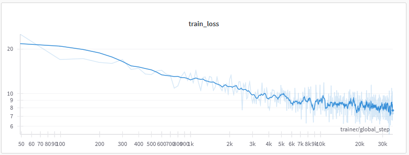

# Autoregressive frequency-domain image generation

Uses a decoder-only transformer to autoregressively generate images in the frequency domain.

## How it works

Here are some bulletpoints on how it works:

- A few invertible transformations are done on the image to put them into frequency domain in a nice format for autoregressive prediction. These need to be undone again for plotting.
  - fourier-transform without redundancy using rfft2
  - flatten and sort by the magnitude of the frequency, because we want to start predicting the low frequencies first
- Prepend the label (0-9 for mnist/cifar10, 10 for unconditional) so we know what to generate
- Causal decoder-only transformer is trained in the usual way, and uses the LLaMa architecture
- The model uses a patchification layer to downsample the image
- We randomly drop out the label (i.e. use 10 as label indicating unconditional generation) so we can apply classifier-free guidance in inference

Note that no time was spent optimizing the architecture etc. and this is more of a proof of concept.

## Examples

Below are some examples output where we autoregressively sample 15 pixels at a time (because that's the patchification size). The left part is the frequency domain.

**Unconditional**

https://github.com/user-attachments/assets/8e62b4e7-52b0-41ac-8e00-98db4466e192

**Seven CFG=1**

https://github.com/user-attachments/assets/a5aac7b6-23ac-40a7-b07d-0ed6d480960b

**Seven CFG=2**

https://github.com/user-attachments/assets/eb7fae5b-e632-4359-9f3a-d375732af33f

## How to run

- `uv sync` to install dependencies
- `python -m freq_ar.train --compile-model` to run

Here's how the loss looks during training

